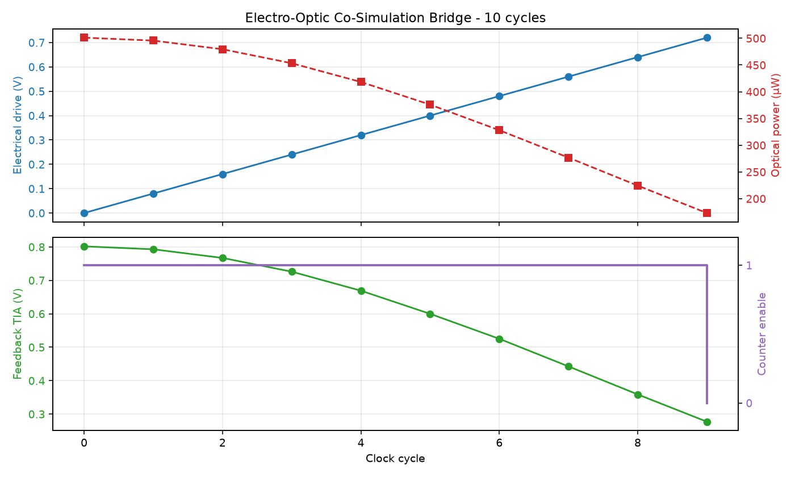
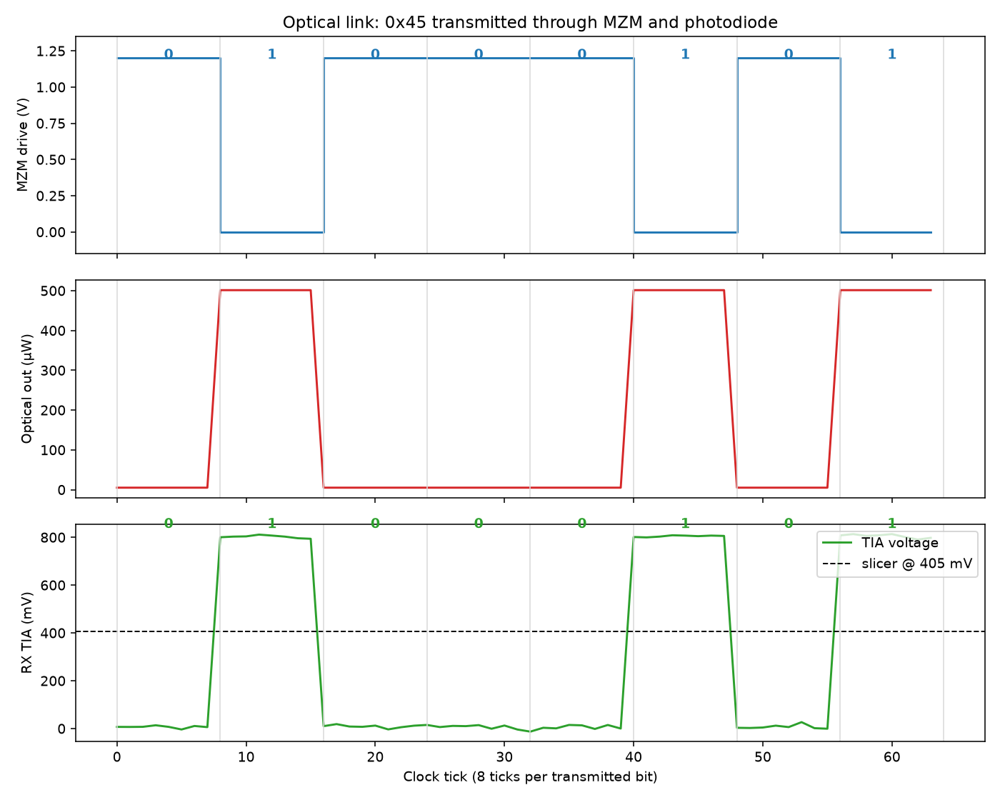

# eo-bridge

**A small Python bridge that closes the loop between an RTL simulator and
a photonic-circuit simulator, cycle by cycle, in a single process.**

The point: today, designing a chip with both electronics and silicon
photonics on it means hand-shuffling stimulus between two unrelated
tools (Cadence/Synopsys on one side, Lumerical/Ansys on the other).
That round-trip is hours-to-days for what should be a 100 ms feedback
loop.  `eo-bridge` shows what the "no email, no CSV" version looks like.

Status: **MVP**. End-to-end working demos; not a tape-out tool.



## What's actually in here

* `eo_bridge/translator.py` - all the unit conversions (logic state ⇄ V,
  V ⇄ Δφ, V_TIA ⇄ 1-bit enable).  One file so the physics is in one
  place.
* `eo_bridge/electrical_sim.py` - PyRTL hardware: an N-bit counter
  (`ElectricalCounter`) and a ROM-backed bit serializer
  (`ElectricalTransmitter`).
* `eo_bridge/optical_sim.py` - analytical Mach-Zehnder modulator + Ge-on-Si
  photodetector + TIA.  Default backend, zero heavy deps.
* `eo_bridge/simphony_backend.py` - the *same* MZM built out of Simphony
  / `sax` primitives.  Provably equivalent to the analytical one (see
  `tests/test_simphony_parity.py` -> agreement to 1e-8).
* `eo_bridge/co_simulation_bridge.py` - the orchestration loop itself.
* `run_test.py` - 10-cycle closed-loop demo: PyRTL counter drives an MZM,
  the photodetector's feedback gates the counter.  Renders
  `co_simulation.png`.
* `tx_pattern_demo.py` - end-to-end NRZ transceiver: streams an 8-bit
  pattern through the optical link, recovers it on the receiver side,
  and reports BER. Renders `tx_pattern_demo.png`.

## Quick start

```bash
git clone https://github.com/uJ1NO/eo-bridge.git
cd eo-bridge
python3 -m venv .venv
source .venv/bin/activate
pip install -r requirements.txt

python tests/test_translator.py        # unit tests for the unit conversions
python tests/test_simphony_parity.py   # Simphony vs analytical (1e-8 agreement)
python run_test.py                     # closed-loop 10-cycle demo
python tx_pattern_demo.py              # NRZ byte sent through the optical link
```

If you don't want the ~300 MB of JAX/sax pulled in by `simphony`, you
can install just the core:

```bash
pip install pyrtl numpy matplotlib
```

The default backend is the analytical MZM and does not need Simphony.

## How a cycle of the bridge actually flows

```
   enable(t)  ──► PyRTL.step()  ──► count(t)
       ▲                                │
       │                                ▼
       │                  Translator: count -> V_drive
       │                                │
       │                                ▼
       │            OpticalLink: V_drive -> (P_out, V_TIA)
       │                                │
       │                                ▼
       └── Translator: V_TIA -> enable(t+1)
```

Every per-cycle quantity is captured in a `CycleSample` dataclass.  The
plots are just `matplotlib` over a list of those.

## Two demos worth running

### 1. Closed-loop self-arrest (`run_test.py`)

A 4-bit counter sweeps through a full V_π drive range.  The photodetector
voltage drops as the MZM transitions from bright to dark.  When it
crosses a threshold the bridge feeds `enable=0` back into PyRTL and the
counter stalls - the loop has closed itself.

```
cyc  cnt  V_drv   P_out_uW   V_fb   en_out
  0    0  0.000     501.19   0.804      1
  1    1  0.080     495.71   0.793      1
  2    2  0.160     479.52   0.768      1
  3    3  0.240     453.33   0.725      1
  4    4  0.320     418.27   0.670      1
  5    5  0.400     375.89   0.601      1
  6    6  0.480     328.03   0.525      1
  7    7  0.560     276.79   0.443      1
  8    8  0.640     224.40   0.360      0   <-- feedback flips
  9    9  0.720     173.16   0.276      0
```

### 2. NRZ optical link sending a byte (`tx_pattern_demo.py`)

Streams `0b01000101 = 0x45` through the modulator. The receiver slices
the TIA voltage at the middle of each bit and recovers the byte.

```
TX byte: 0x45
RX byte: 0x45  errors=0/8  BER=0
```



This is the same signal path used by chip-to-chip optical interconnects
in production silicon (Ayar Labs TeraPHY, Lightmatter Passage, and
similar), reduced to a single Python process for fast iteration.

## Why this exists

Photonics startups (Ayar Labs, Lightmatter, Lightelligence, Celestial AI)
are shipping silicon now because AI clusters have run out of copper
bandwidth between accelerators. All of them need a way to co-simulate
digital logic and optical interconnects without bouncing between two
separate CAD ecosystems. The open-source photonic stack
(`gdsfactory` + `simphony`) covers the layout and simulation side
well, but the **electrical co-simulation hook is missing**. This
repository is an initial step toward filling that gap.

## Roadmap (contributions welcome)

- [ ] Foundry PDK validation: replace the ideal MZI with `siepic.MZI` or
      a GlobalFoundries Fotonix component and compare against vendor
      S-parameters.
- [ ] Thermal port on the translator: silicon's `dn/dT` is the same
      order of magnitude as `dn/dV`, so any drift above a few Kelvin
      invalidates the current model.
- [ ] Verilator/cocotb electrical backend so the bridge can drive a real
      RISC-V core (PicoRV32) instead of a counter.
- [ ] Eye-diagram plot (overlay many bit periods, compute eye-opening +
      jitter).
- [ ] WDM example: PyRTL selects a wavelength bin, a ring resonator
      drops it.
- [ ] Differentiable sweep through the MZM transfer function via JAX,
      using the fact that `sax` is already JAX-native.

## License

MIT. See `LICENSE`.

## About

Developed by **Juxhino Kapllanaj** at
**[Presison](https://presison.com)**. Presison is building open,
Python-native tooling for electro-optic co-design. This repository is
the first public artifact toward that goal.

- Web: <https://presison.com>
- LinkedIn: <https://www.linkedin.com/in/juxhino-kapllanaj-87904322b>
- GitHub: <https://github.com/uJ1NO>

Issues, Discussions, and pull requests on this repository are welcome.
